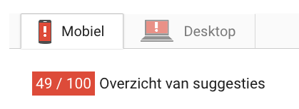
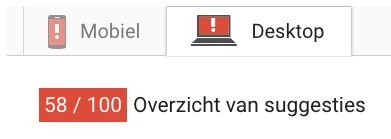
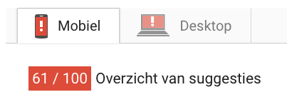
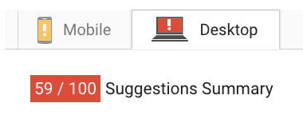
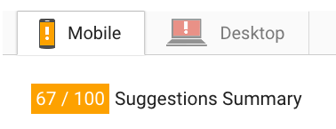
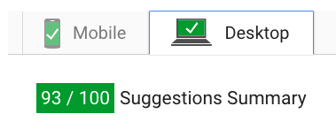
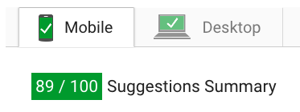
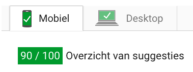
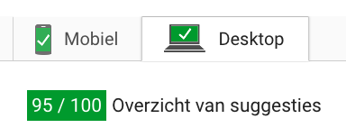
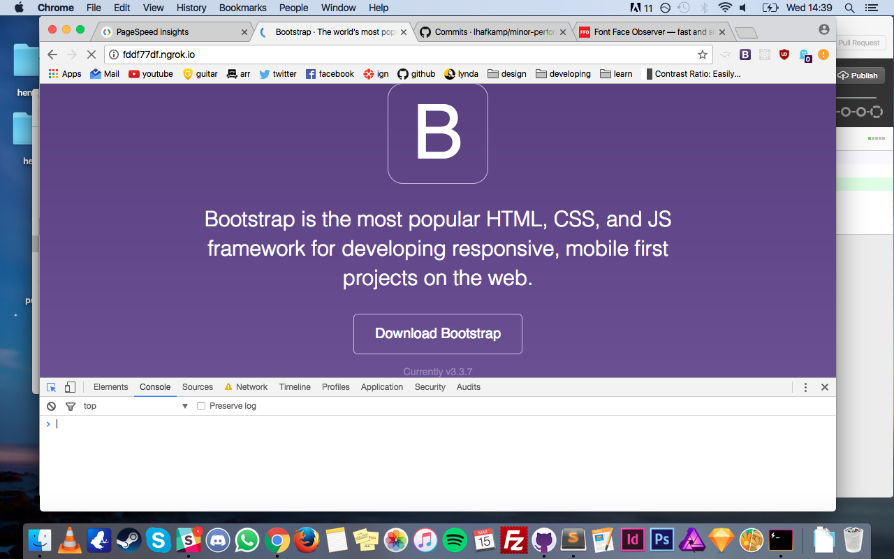

# minor-performance
Assignments for the course Performance Matters

## Improving Bootstrap
This week I improved the performance of the Bootstrap site. I used <a href="https://developers.google.com/speed/pagespeed/insights/?hl=nl">PageSpeed Insight</a> to track the progression of my performance improvements.

## My GitHub structure
I used feature branches for every improvement I created. These features are merged with the *features* branch so you can see the difference by the unedited *master* branch and the edited *features* branch. So if you wanna check out all the improvements at once, *features* is your branch.

..

*features*

## The current speed
  
Desktop - 48/100  
  
Mobile - 49/100  
  
*As you can see the speed isn't very optimal, I'm about to change that*

## Feature #1 - gzip
  
Desktop - 58/100  
  
Mobile - 61/100  
  
*Gzip is already a huge improvement. Gzip makes sure that the files becomes 'zipped' like you would do on your computer, but instead of the computer these zip's go to the browser.*

## Feature #2 - critical css
  
Desktop - 59/100  
  
Mobile - 67/100  
  
*Critical css loads the css that fills your viewport first so it can load the latter while you're still looking at the zero-state*

## Feature #3 - image compression
  
Desktop - 93/100  
  
Mobile - 89/100  
  
*I compressed the images manually to the point that you don't really see the difference because of the size I'm using the images at. After that I compressed them through <a href="compressor.io">compressor.io</a>. As you can see this made a huge difference in terms of speed and if you compare these images with the old <a href="http://getbootstrap.com/">http://getbootstrap.com/</a> you can't visually see a lot of difference.*

## Feature #4 - minifying css/js
  
Desktop - 94/100  
  
Mobile - 90/100 
  
*I used <a href="http://gulpjs.com/">Gulp.js</a> to minify my css/js. Not a whole lot of improvement but every little bit counts.*

## Feature #5 - webp images
  
Desktop - 95/100  
  
Mobile - 91/100
  
*Here I used srcset to use webp images whenever you open the website in Chrome. If the browser isn't Chrome it falls back to the old jpgs.*

## Feature #6 - fontfaceobserver
  
Before the font is loaded  

  
After the font is loaded  
  
*Not a speed improvement but it certainly makes your website better. Fontfaceobserver makes sure you see a fallback font until the custom font is loaded. This way we don't have to see empty font-less spots while loading the website.*

## Conclusion
So we wen't from:  
  
**Desktop**  
48/100 to 95/100  
  
**Mobile**  
49/100 to 91/100  

Quite the improvement!

## What would I've liked to do more?
#### Minify the HTML
*It seemed like a big hassle with the Node.js templating going on.*
#### Lazy loading
*I really want to learn this, I'll make sure to implement this next week.*
#### Look into http/2
*It is the future after all.*
#### Try out Webpack instead of Gulp for some compression tasks
*Not a necessity but will look into this next week.*

